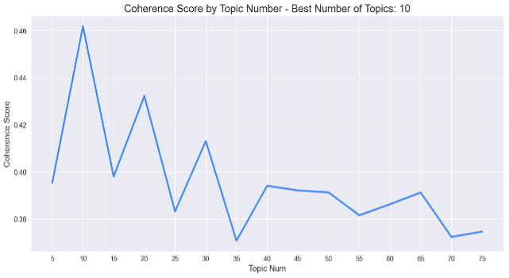
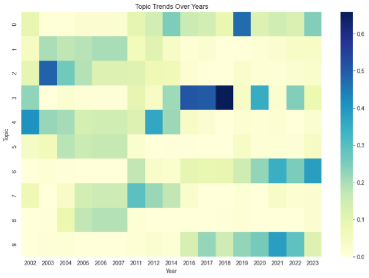
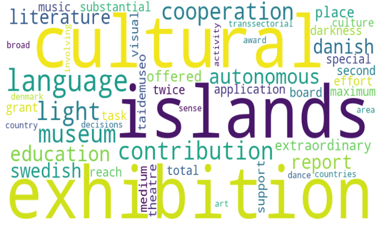
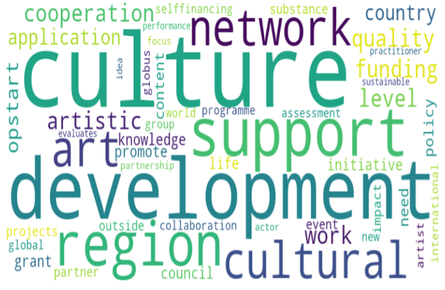

# Exploring Nordic Added Value in Cultural Cooperation: A Case Study of the Nordic Culture Fund through Non-negative Matrix Factorisation (NMF) Topic Modeling

## Introduction 

This is a code for my MA thesis, which aims to answer following questions:

1. How did the understanding and implementation of Nordic added value change throughout the research period?
2. What kind of regionalist logic has been utilised in this process?

## Data collection and the creation of dataset

The English web pages of the Nordic Culture Fund from 2002 to 2023 were selected as a primary database for this research, complemented by the organisation’s policy documents.

Data from 2002 to 2022 were collected using the the web-archive database [<em>Wayback Machine</em>](https://web.archive.org), and the data for 2023 was scraped from the web page of the [<em>Nordic Culture Fund</em>](https://nordiskkulturfond.org/en).

## Data preprocessing

The research followed common data preprocessing procedures including tokenisation, lemmatisation, lowercasing, nonalphabetical character removal, and stopword removal.

* For tokenisation and Lemmatisation, `Natural Language Toolkit(NLTK)` package was utilised.
* For Stopword removal, pre-established English stopword list from `scikit- learn` was used. Additionally, insignificant words found in the collected documents were later included in the stopwords list. 
* For other basic text processing including non-alphabetical character removing and lowercasing, Python functions `re.sub()` and `lower()` were used

## Model building and selection

Topic coherence pipeline module by `Gensim` was used to evaluate the coherence score of the model, and the `scikit-learn` was used to build the Topic Model. 

The results for each coherence score analysis are in below figure 1. Considering the coherence score, 10 was chosen for the number of topics of analysis.

## Results
### Topic Model
| Topic | Keywords |
|-------|----------|
| Topic 0. Aims of cultural policy | culture cultural art development policy support knowledge region initiative grant network cooperation council life work need quality promote artistic level |
| Topic 1. Nordic Culture Event of the Year (a) | exhibition museum place contribution offered extraordinary application twice second darkness substantial effort grant total special light board reach taidemuseo maximum |
| Topic 2. traditional arts and mediums | support cultural theatre task medium music visual cooperation culture transsectorial sense islands decisions dance broad art award autonomous education literature |
| Topic 3. Quality assessment | funding content application support quality projects partner impact event region artistic culture outside substance selffinancing group country cooperation assessment level |
| Topic 4. Nordic boundaries and heritage | activity country area islands cultural involving countries education denmark cooperation priority heritage greenland faroe language iceland eastern contribution aland new |
| Topic 5. Cultural Research project | politics report cultural light exchief habit partial comprehensive heading islands researcher political daily administration sami model swedish autonomous population literature |
| Topic 6. Global collaboration | globus global programme artist new collaboration world network opstart art work development cultural international partnership focus actor practitioner performance sustainable |
| Topic 7. languages and youth | comprehension investigation norwegian young language people swedish danish nonscandinavian english location changed youth report parent languages neighbouring change comparison reveals |
| Topic 8. Nordic Culture Event of the Year (b) | museum congo ethnographic stockholm north exhibition object oslo copenhagen november national exhibitions title came danish collection colonization bear witness opened |
| Topic 9. Opstart funding programme | opstart application idea support evaluates funding development expense material region travel phase welcome sufficiently country participating culture individual engagement start |

### Chronological Analysis
#### TF-IDF weighted heatmap 

Heatmap shows that the presence of Topics 1, 2, 4, 5, 7 and 8 were stronger during the years 2000 to 2014, whilst topics 0, 3, 6 and 9 were significantly prevalent during the recent period after 2016. 

#### TF-IDF weighted word cloud based on Topic 1,2,4,5,7 and 8.

#### TF-IDF weighted word cloud based on Topic 0,3,6 and 9.

 The result indicates that there was a shift in the relational understanding of the concept, accompanied by a corresponding shift in regionalist logic. Initial focus of the Fund was on the Nordic level, encouraging projects related to Nordic collaboration. Regionalist logic of scale and identity was found, in which the region aims to create a sense of community, whilst emphasising the common identity based on the heritage. 
 
 However, since the late 2010s, the understanding of the concept was extended towards the global level. Regionalist logic of economy was found, in which the region builders utilise regionalism as a means of promoting and positioning region in the global market. This was done by integrating neoliberal values to the funding intiatives, and expanding its target from Nordic to global stage. 

## Summary 
* This study aimed to examine the potential shift in the implementation of Nordic added value, and identify the potential reason for this shift

* Initially, the Fund emphasised internal Nordic collaboration, based on heritage identity to foster the sense of Nordic community and legitimise Nordic cultural cooperation. 

* However, since the late 2010s, the focus shifted towards the global context, integrating neoliberal values to promote Nordic culture on the global stage. 

